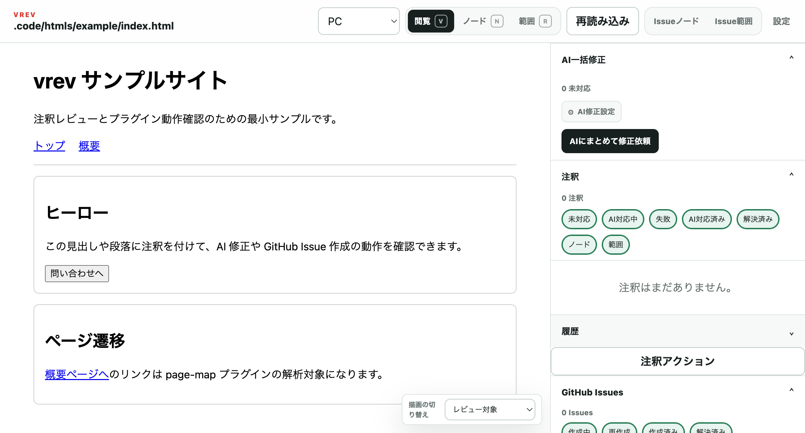
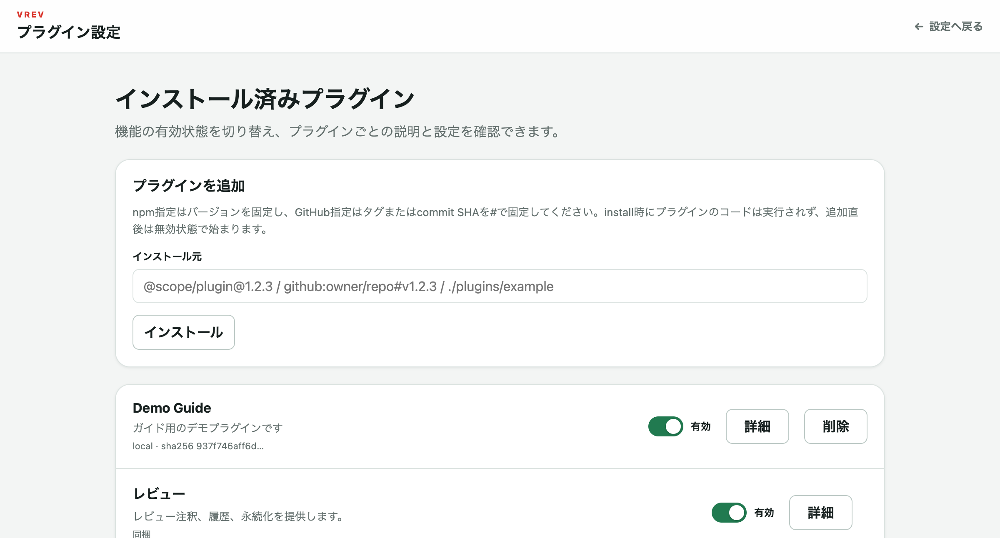

# vrev

[](https://github.com/NAKAK10/vrev/actions/workflows/docs.yml)
[](https://github.com/NAKAK10/vrev/actions/workflows/ci.yml)

📚 ドキュメントサイト: https://NAKAK10.github.io/vrev/

HTML・画像・ローカルWebアプリへ注釈を付け、coding agentによる修正やGitHub Issue作成につなげるローカルVrevツールです。

プラグイン開発は [`docs/plugin-guide.md`](docs/plugin-guide.md)（開発手順メイン、base plugin の画面付き）、ドキュメントサイトの公開手順は [`docs/site-publish.md`](docs/site-publish.md) を参照してください。

## 主な機能

- DOMノード・矩形範囲への注釈
- PC／タブレット／スマートフォン表示の切り替え
- 注釈スレッド、状態、履歴、フィルター管理
- OpenCode／Claude／Codex／GitHub Copilot／Pi／カスタムCLIによるAI修正
- AIによるIssueラフ生成と`gh`経由のGitHub Issue作成
- static HTML、localhostアプリ、HTTPSのstagingサイトに対応

## 必要環境

- Node.js 20以上
- GitHub Issueを作成する場合は、認証済みのGitHub CLI（`gh`）。公式`github-issue`プラグインは初回起動時に自動導入されます
- AI修正を使う場合は、対応するcoding agent CLI

## インストール

各packageはpublic npm registryから取得できます。標準構成を対象workspaceの直接依存として追加すると、Coreが`package.json` metadataから検出します。

```bash
npm install --save-dev \
  @vrev/cli@1.0.0-beta \
  @vrev/ai@1.0.0-beta \
  @vrev/storage-firestore@1.0.0-beta \
  @vrev/review@1.0.0-beta \
  @vrev/annotation-workflow@1.0.0-beta \
  @vrev/page-map@1.0.0-beta \
  @vrev/github-issue@1.0.0-beta
```

```bash
npx @vrev/cli serve --target .code/htmls/example/index.html
```

first-party feature packageは **AI、Firestore、review、annotation-workflow、page-map、github-issueの6つ**です。AI packageが利用するCLIの選択、外部AIコマンドの登録・検証・実行、`ai/v1` capabilityを所有します。annotation-workflowとgithub-issueは用途に合うAIを`ai/v1`へ依頼するだけで、利用者にAIを選ばせません。Firestoreが不要なworkspaceでは`@vrev/storage-firestore`を省略できます。plugin開発用contractには`@vrev/plugin-sdk@1.0.0-beta`を導入し、codeでは`@vrev/plugin-sdk`からimportできます。

sourceから利用する場合:

```bash
git clone https://github.com/NAKAK10/vrev.git
cd vrev
npm ci
npm run build
npm link
```

## 起動

対象リポジトリで実行します。

```bash
vrev serve --target .code/htmls/example/index.html
```

画像:

```bash
vrev serve --target assets/example.png
```

起動済みのlocalhostアプリ:

```bash
vrev serve --target http://127.0.0.1:5173
```

開発サーバーも起動する場合:

```bash
vrev serve \
  --target http://127.0.0.1:5173 \
  --start "npm run dev"
```

同一LAN上のprivate IPもHTTPで指定できます:

```bash
vrev serve --target http://192.168.11.13:3000
```

HTTPSのstagingサイト:

```bash
vrev serve --target https://staging.example.com/products
```

既定ポートは`18765`です。使用中の場合は次の空きポートを自動選択します。起動後は既定ブラウザを開き、ブラウザ起動コマンドの完了まで待って取りこぼしを防ぎます。`--no-open`でブラウザの自動起動を無効化できます。

## JavaScriptを含むHTML

ローカル対象のJavaScriptは既定で有効です。無効化する場合は左上の「設定」から「対象のJavaScript」をオフにしてください。この設定はworkspaceの`.vrev/settings.json`へ保存されます。公開HTTPS URLでは設定にかかわらず常にJavaScriptを無効化します。

## 操作

- `V`: 閲覧
- `N`: DOMノード選択
- `R`: 矩形範囲指定
- `⌘+Enter` / `Ctrl+Enter`: 注釈・返信・Issueの送信
- AI設定: AI packageでCLI選択と外部AIコマンドを設定し、annotation-workflowで並列数と自動実行を設定
- `GitHub Issueにする`: AIが編集可能なIssueラフを作成し、確認後にGitHubへ追加

外部AIコマンドには依頼文を渡す`{prompt}`を1回だけ記述します。commandはshellを介さず実行され、登録前にtool利用能力を検証します。

```text
agent-command --prompt {prompt}
```

API keyやtokenはcommandへ記載せず、各CLIの認証設定または環境変数を利用してください。

## プラグイン

schema v4のPlugin Hostが現在の既定architectureです。Coreの宣言的rendererが、pluginの検証済みJSON UI documentを描画します。first-party feature packageは`ai`、`firestore`、`review`、`annotation-workflow`、`page-map`、`github-issue`の6つです。`ai`がCLI選択と外部AIコマンドを含むAI method管理、`review`が注釈・履歴・永続化、`annotation-workflow`がAI job、`page-map`が画面遷移解析、`firestore`がremote storage、`github-issue`が専用のIssue選択・modal・sidebar・GitHub処理を所有します。feature package同士は実装に依存せず、versioned host capabilityだけで接続します。

Coreは対象workspaceの`dependencies`、`devDependencies`、`optionalDependencies`に列挙された直接依存だけを検出します。packageは`vrev.apiVersion: 1`とmanifest pathを宣言し、検出時にcodeを評価しません。`node_modules`全体や推移依存は走査しません。

従来の`.vrev/plugins/<plugin-id>/`と`.vrev/plugins.json`は移行用compatibility layerとしてnpm packageと統合されます。同じplugin IDが両方に存在する場合は曖昧な実装を選ばずエラーにします。`.vrev`には設定、credential、review/runtime状態だけを置き、npm package本体はコピーしません。global Coreだけで利用する既存workspace向けには標準packageのbundled copyもone-beta互換として維持します。

ローカルdirectoryと公開npm package specによる手動追加や、新規pluginのbase生成もできます。`plugin create`はprovider/command互換のschema v3 manifest、title/summary、README、設定項目テンプレート、example command、testを生成します。server capabilityや宣言的UIを提供するpluginは[`docs/plugins.md`](docs/plugins.md)のschema v4 contractへ更新してください。

```bash
vrev plugin create --help
vrev plugin create my-plugin \
  --title "My Plugin" \
  --summary "レビュー処理を拡張します" \
  --install
vrev plugin run my-plugin hello world
vrev plugin install ./plugins/firestore
vrev plugin list
```

プラグイン管理画面への「設定」メニューは左上に既定表示します。明示的に非表示へ切り替える場合だけworkspace設定へ`false`を指定します。UI内にこの表示切替はありません。

```json
// .vrev/settings.json
{
  "ui": { "plugin_management": false }
}
```

有効/無効、manifestで宣言した必要情報、README、AI packageが所有するCLI選択と外部AIコマンド登録は左上の設定画面へ集約されます。workspace値はGit管理外の`.vrev/plugin-settings.json`へ保存し、token/passwordは保存せず環境変数項目として存在だけを表示します。

`/settings/plugins`からもnpm specやGitHubリンクでpluginをinstall・removeできます。npm specはexactなversionを、GitHub specはtag/commit SHAを`#`で固定してください（未固定のGitHub specは拒否します）。install時にplugin codeは実行されず、追加直後は無効状態で始まるため、内容を確認してから有効化してください。認証情報を含むURLは拒否します。同梱pluginはUIから削除できず、無効化だけができます。

プラグインcommandは次の形式で実行します。

```bash
vrev plugin run <plugin-id> <command> [args...]
```

このrepositoryには次の6つのfirst-party feature packageを収録しています。

- [`plugins/ai/`](plugins/ai/README.md): CLI選択、外部AIコマンド管理、共通AI実行
- [`plugins/firestore/`](plugins/firestore/README.md): Firestore RESTをworkspace storage backendとして使うprovider
- [`plugins/review/`](plugins/review/README.md): reviewの保存・検証・表示
- [`plugins/annotation-workflow/`](plugins/annotation-workflow/README.md): 注釈保存・再オープン後の自動実行ポリシー
- [`plugins/page-map/`](plugins/page-map/README.md): 静的HTMLの画面遷移マップ
- [`plugins/github-issue/`](plugins/github-issue/README.md): `gh`を使うGitHub Issue provider

 GitHub Issue作成は自動導入された`github-issue`プラグインを使います。`gh`認証は自動化せず、対象repositoryに合う利用者で事前に認証してください。base作成方法、第三者のnpm/GitHub pluginの導入、安全性は[`plugins/README.md`](plugins/README.md)、manifestとPlugin APIの詳細は[`docs/plugins.md`](docs/plugins.md)を参照してください。開発手順の通しガイドは[`docs/plugin-guide.md`](docs/plugin-guide.md)です。

base plugin（`vrev plugin create` のscaffold）がレビュー画面のsidebarへ追加する「注釈アクション」ボタンと、`/settings/plugins` の管理画面:





beta.7では宣言的rendererが`/`、`/settings`（レイアウト設定）、`/settings/plugins`（install済みplugin）の既定です。one-beta rollback用に`/legacy`、`/settings/legacy`、`VREV_LEGACY_UI=1`と既存HTTP/CLI・manifest schema v1–v3互換を保持しています。新規integrationはschema v4を使用してください。desktop/tablet/mobileのbrowser acceptanceとlegacy route切替をrelease gateで確認済みです。

### 画面遷移マップ

同梱`page-map`プラグインは、対象と同じ公開directory配下のHTMLを静的解析し、ページ間の遷移をグラフで俯瞰します。レビュー画面のstage切り替えmenuから「画面遷移マップ」を選ぶと表示されます。解析中は対象ページを一切開かず、ネットワークへもアクセスしません。

解析するのは公開directory配下の`.html` / `.htm`だけです。`.vue`・`.jsx`・`.tsx`・`.php`などのソースfileは読みません。

| 対象 | 対応状況 |
|---|---|
| 静的HTML（`.html` / `.htm`） | 対応 |
| ビルド後の静的HTML（framework製・複数file出力） | 対応（通常の静的HTMLとして解析） |
| SPA（1つの`index.html`＋クライアントside routing） | 非対応（HTML上に遷移先が現れないため） |
| localhostアプリを対象にした場合（`--target http://...`） | 非対応（空の結果と警告を返す） |
| Vue / React / Svelte / Angular のソースfile | 非対応（`.vue`・`.jsx`・`.tsx`を読まない） |
| vue-router / React Routerのroute定義、`<router-link to>` / `<Link to>` | 非対応 |
| Next.js / Nuxtのfile-based routing | 非対応 |
| WordPress（PHPテーマ） | 非対応（`.php`を読まない） |
| 動的に組み立てられる遷移先（変数・API応答・条件分岐） | 非対応（「解析できなかった遷移」として件数のみ表示） |

つまり現状は**出力済みの静的HTMLを対象にした機能**です。frameworkを使っていても、ビルド結果のHTMLがpage単位で公開directoryへ出力されていれば俯瞰できます。route定義やソースfileからの解析はPhase 2の予定です。

抽出する遷移の種類、上限、cacheなどの詳細は[`plugins/page-map/README.md`](plugins/page-map/README.md)を参照してください。

## データ保存

レビュー情報は対象Gitリポジトリの`.vrev/`へ保存します。

```text
.vrev/
├── settings.json
└── reviews/<target-id>/
    ├── review.json
    ├── resolved.json
    ├── context.json
    └── job-state.json
```

`job-state.json`などのruntime情報はGit管理対象外です。

## 対応対象と安全性

- local fileは`.code/htmls/**/*.html`と`assets/`配下の画像に対応
- localhostは`localhost`、`127.0.0.1`、`::1`をHTTPで許可
- private networkのIP literal（`10/8`、`100.64/10`、`172.16/12`、`192.168/16`、IPv6 ULA/link-local）をHTTPで許可
- public targetはHTTPSのみ許可し、cookie・authorizationを転送しない
- public targetではJavaScript、form、ローカルAI APIを無効化
- GitHub Issueは対象リポジトリ内で`gh issue create`を実行して作成

## 開発

```bash
npm ci
npm test
npm run build
```

## リリース

GitHub Releaseを公開すると、GitHub Actionsがtest/buildを実行し、npm trusted publishing（OIDC）で全packageをpublic npm registryへpublishします。このbeta releaseでは全8 packageのversionを`1.0.0-beta`に揃え、release tagを`v1.0.0-beta`、npm dist-tagを`beta`にします。

```bash
npm version 1.0.0-beta --no-git-tag-version
npm test
npm pack --dry-run
git diff --check
```
